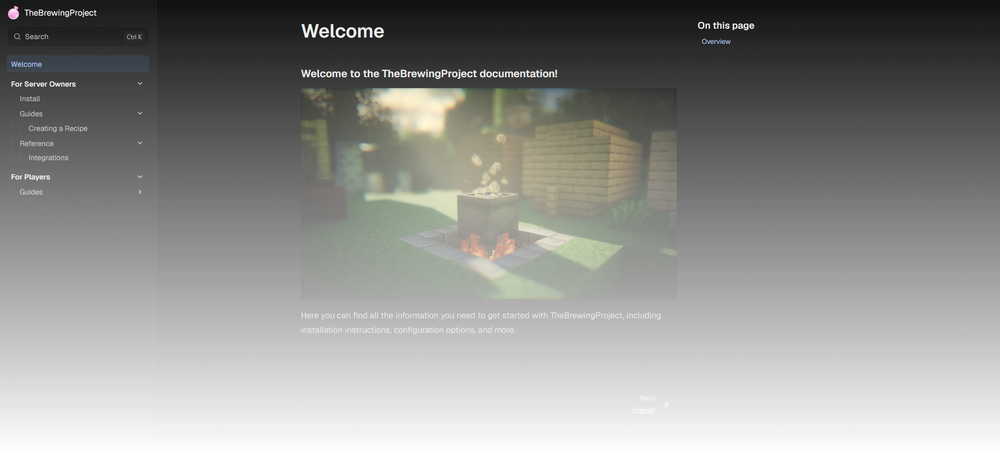

# TheBrewingProject Documentation



## Running a development server

### 1. Install Dependencies

#### npm

```bash
npm install
```

#### d2

D2 is required for diagrams.

See https://github.com/terrastruct/d2/blob/master/docs/INSTALL.md

### 2. Start the Development Server

```bash
npm run dev
```

Site will be available at `http://localhost:4321/`.
